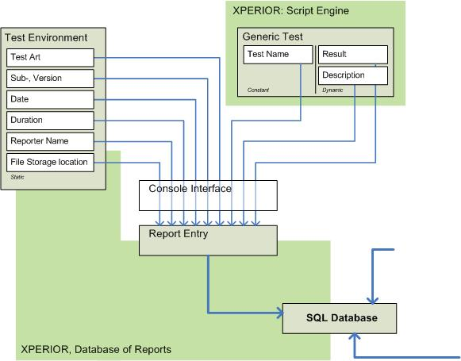
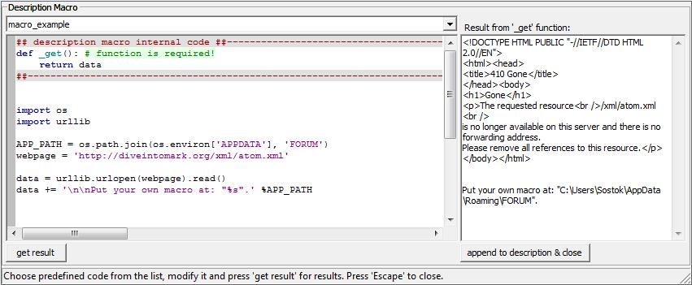

.. _reporter:

********
Reporter
********

.. sidebar:: Summary

    :Info: Reporter, test results administration database.
    :Target: users
    :Status: mature

.. index:: single: reporter

Reporter offers clear overview and multiple-users administration of test results reports. Tests result reporting is an important part of testing cycle.

Let's consider that you have a script controlling and measuring maximal RF power of certain UE. Test results passes for firmware version x.y but fails for x.z. You also know that the results differ for tester A and tester B and that they may use different version of the script. The test logs and UE logs are available on network drive.

To transform a chaos to the order, keep reading further about Reporter. Real example from ``[Xperior distribution]\addons\`` is part of following description...

---------------------------

General description
-------------------

By structuring the example in introduction, we get that a **generic test** is defined by *test name* and generates a *test result* and *test result description*. **Test environment (Reporter)** defines additionally *test art*, *sub-, version* of DUT, *time and date* and *duration* of the test, *reporter name* and *file storage location* of generated logs. Combination of these elements creates a **report entry**. Graphical interpretation is drawn on following figure.

.. note:: Mentioned parameter names, count and overall structure can by customised on runtime, e.g. in :ref:`startup`

    
    Figure: Reporter functionality block
    

Typical test suite consists of fixed set of scripts and variable count of **report entries**. Scripts are defined by unique *test names*. The number of **report entries** evolves with tested software or firmware development. In **Reporter** this evolution is divided to *major* and *minor versions*. Logically *major version* is superordinate and contains one or more *minor versions*. It would be possible to define higher level of versions, but it will also add disproportinally more complexity to the application. Therefore we stay by two.

Selection of Script directory
*****************************

List of the unique *test names* is created from the script names, more specifically from final component of absolute path without extension. List of absolute paths is result of searching for files with ``*.i?e`` extension contained in Scripts directory.

To create unique *test names* press ``Select Scripts`` button and select a directory containing script files.::

    For learning purpose, select [Xperior distribution]\addons\multitesting.

Selection of Report directory
*****************************

The final product of *major version* is understood as milestone, such customer release and is commonly the last stable *minor version*. All the **report entries** for certain *major version* are stored in ``[major_version_name]_report.txt`` file. **Report entries** contain one or more different *minor versions* (alpha, beta version, daily builds, etc). Single *minor version* only means that *major version* = *minor version* and such case is unusual.

``[major_version_name]_report.txt`` file can be selected by ``Select Reports`` button. You select a directory containing reports files and than choose your *major version* reports. Why you have to specify a directory instead of just a file is explained later in chapter `compare`_.::

    For learning purpose, select [Xperior distribution]\addons\multitesting\reports and than specify the *major version* 2.0.

Control elements
----------------

==================  ===============  ===========
Name                Widget Type      Description
==================  ===============  ===========
*Reports*           Button           selects a directory containing report files. Search for files in all subdirectories
*Scripts*           Button           selects a directory containing script files. Search for files in all subdirectories. Wildcard of script files is ``*.i?e``
*Create*            Button           create a new report file
*Save*              Button           :kbd:`Alt + F12` - :ref:`saves(!) <multiple_admin>` and reloads the content of current report file - *major version*
*Remove*            Button           removes the selected major version with all of the associated reports from the database
*Update*            Button           re-collect reports from already selected report file.
*Row Filter*        Search Control   displays only script files containing that string
*Column Filter*     Search Control   displays only product versions containing that string
*Keyword Filter*    Search Control   displays only results matching the result's keyword value
*Major version*     Choice Control   switches between major versions
*View element*      Choice Control   changes which report element should be displayed
*Export*            Button           export the reports with selected view element
*Export All*        Button           export the reports with all view elements
------------------  ---------------  -----------
*New Report*        Button           :kbd:`Alt + N` - creates a new report entry for selected script file
*Save Report*       Button           :kbd:`Alt + S` - saves locally new or modified report entry for selected script file. Data will be lost when selecting another report entry without saving it before. Use Save button when you changes are final
*Del Report*        Button           :kbd:`Alt + D` - for selected script file deletes report entry from internal hash
*Summary*           Button           creates a text summary with content of selected report(s)
==================  ===============  ===========

Properties
----------

.. _multiple_admin:

Multiple-users administration
*****************************

Than the reports can be created/modifed/deleted by users simultaneously. You, as the one of the user, see the changes done by other users when you:

* update the *major version* with ``Update`` button or
* save the *major version* with ``Save`` button or
* change the *major version*

It is guaranted that the database is written sequentially in multi-user environment.

Selectable scripts and reports view depending on folder depth
*************************************************************

As mentioned at the beginning of the chapter, user has to specify the top directory where to start searching and collecting the *test names*. Thus, selecting subdirectory as a top one will result in collecting data just only from this one down. It is useful to examine just say Stress Test folder instead of Stress and Functionality folders.

The same scheme is valid also for reports. With selected *top directory* user can observe/analyze reports inside certain directory structure = major version group. It is useful to combine with Compare View Mode.

View mode
*********

All *major versions* (database of report) are collected from selected *top directory*, alphabetically sorted and all presented *minor versions* are set as columns in a new grid table. In dependence on *View element* selection, all elements from **report entry** can be compared across the *major* and *minor versions*. Slight opacity appears over *all minor versions* belonging to one selected major version. Compare the next two figures.

.. figure:: ../images/XPERIOR-Reporter-ComparingMajorVersions.jpg
    :align: left
    :figwidth: 100 %
    
    Figure: Compare view mode

Editable report panel with hyperlink to pre-selected location
*************************************************************

All of **report entry** elements (['TEST ART'|'TEST COUNT'], 'PROBLEM', 'VERSION', 'DATE', 'DURATION', 'REPORTER', 'DESCRIPTION', 'HYPERLINK' and 'NR.') can be modified here. Additionally ``UPDATE`` button has been added to DATE entry option, ``SUMMARY`` button for creating resume of report and ``DESC. MACRO``, see :ref:`desc_macro` for more.

.. figure:: ../images/XPERIOR-Reporter-EditableReportPanel.jpg
    :align: left
    :figwidth: 100 %
    
    Figure: Editable report panel

    
Script description
******************

Extra panel contains header part of selected script. Header part of your '*.i?e' file needs to meet "requirements for script form" in order to be parsed correctly. Panel is also used as output for report resume. Furthermore, double clicking on chosen line, appends this line to the Communicator’s Commands Editor.

.. figure:: ../images/XPERIOR-Reporter-ScriptsDescription.jpg
    :align: left
    :figwidth: 100 %
    
    Figure: Script description

Reports Export
--------------

offers a possiblity to export the reports to MS Excel sheet. Two buttons are defined for this purpose. ``Export`` exports currently visible view, where ``Export All`` exports predefined sets of most usefull tables from **Compare view** mode and **List view** mode.

.. figure:: ../images/XPERIOR-Reporter-ExportInList.jpg
    :align: left
    :figwidth: 100 %
    
    Figure: Reporter Export

.. figure:: ../images/XPERIOR-Reporter-ExportAllInCompare.jpg
    :align: left
    :figwidth: 100 %
    
    Figure: Reporter Export All

.. _desc_macro:

Description Macro
-----------------

can be used for generation of semi-automated report entry description. Macro is user-declared procedure defined in form of python code. Macro declarations are stored locally under user's application path. Use *macro_example* as a template for your new macro.

    
    Figure: Description macro - example

Performance
-----------

Using adaptive compression method for report files and "virtual list" approach for both, list and compare view modes, the perfomance hugely improved since version 1.9.0. With test setup having 4 report files, each with 10000 reports, 100 minor versions and description containing 0-10kB of characters, the **startup time** has been reduced to **3 seconds (from previous 66 seconds)**.

Testing Cycle
-------------

Although variations exist between organizations, there is a typical cycle for testing.

* **Requirements analysis**: Testing should begin in the requirements phase of the software development life cycle. During the design phase, testers work with developers in determining what aspects of a design are testable and with what parameters those tests work.
* **Test planning**: Test strategy, test plan, testbed creation. Since many activities will be carried out during testing, a plan is needed.
* **Test development**: Test procedures, test scenarios, test cases, test datasets, test scripts to use in testing software.
* **Test execution**: Testers execute the software based on the plans and tests and report any errors found to the development team.
* **Test reporting**: ``Once testing is completed, testers generate metrics and make final reports on their test effort and whether or not the software tested is ready for release.``
* **Test result analysis**: Or Defect Analysis, is done by the development team usually along with the client, in order to decide what defects should be treated, fixed, rejected (i.e. found software working properly) or deferred to be dealt with later.
* **Defect Retesting**: Once a defect has been dealt with by the development team, it is retested by the testing team.
* **Regression testing**: It is common to have a small test program built of a subset of tests, for each integration of new, modified, or fixed software, in order to ensure that the latest delivery has not ruined anything, and that the software product as a whole is still working correctly.
* **Test Closure**: Once the test meets the exit criteria, the activities such as capturing the key outputs, lessons learned, results, logs, documents related to the project are archived and used as a reference for future projects. 